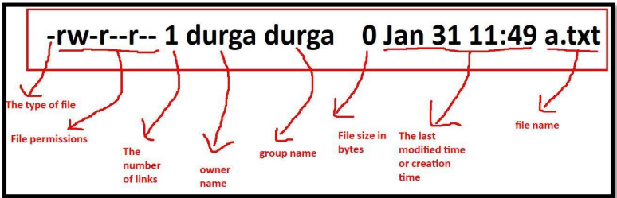

## Linux Commands 
```
SYNOPSIS         top
       ls [OPTION]... [FILE]...
```
## The Most commonly used Basic Commands:
* ~ ( Home Directory )
* / (root Directory)
1. pwd 
-  print name of current/working directory
2. ls[Reference](https://man7.org/linux/man-pages/man1/ls.1.html)
- list directory contents 
3. ls -l[Reference](https://man7.org/linux/man-pages/man1/ls.1.html)
- use a long listing format
4. ls -la [Reference](https://man7.org/linux/man-pages/man1/ls.1.html)
- use a long listing format and do not ignore entries starting with "." (hidden files)
5. cd  [Reference](https://man7.org/linux/man-pages/man1/cd.1p.html)
- change the working directory
6. mkdir  [Reference](https://man7.org/linux/man-pages/man1/mkdir.1.html)
- make directories
7. touch [Reference](https://man7.org/linux/man-pages/man1/touch.1.html)

- change file timestamps and to  create a empty file 
8. rmdir [Reference](https://man7.org/linux/man-pages/man1/rmdir.1.html)
- remove empty directories
9. rm [Reference](https://man7.org/linux/man-pages/man1/rm.1.html)
- rm - remove files or directories
10. rm -r [Reference](https://man7.org/linux/man-pages/man1/rm.1.html)
- remove directories and their contents recursively
11. cal [Reference](https://man7.org/linux/man-pages/man1/cal.1.html)
- cal - display a calendar
12. date [Reference](https://man7.org/linux/man-pages/man1/date.1.html)
- date - print or set the system date and time
13. clear [Reference](https://man7.org/linux/man-pages/man1/clear.1.html)
- @CLEAR@ - clear the terminal screen
14 exit
- To logout session

## Topic: Linux File System
- In Linux everything is treated as File. All files are divided into 3 types




The first character represents the type of file.
d  Directory File
-  Normal File
l  Link File
c  Character Special File
b  Block Special File
s  Socket File